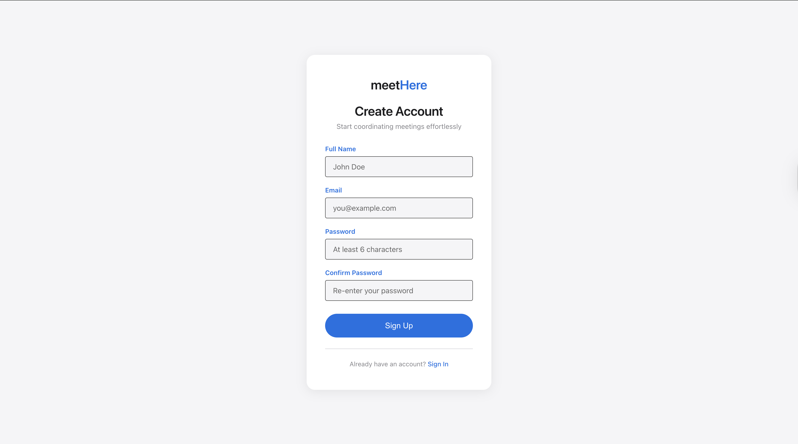
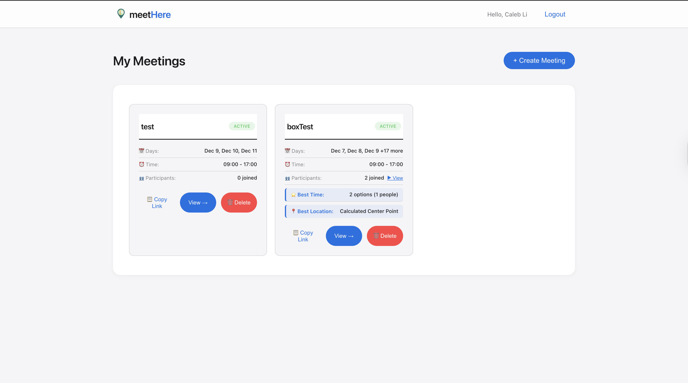

# meetHere 📍

**Streamline group coordination for teams everywhere**

meetHere is a web-based application designed to solve the two most common friction points in student group work: finding a time when everyone is free and finding a location that is geographically fair for all attendees.

By integrating a "when2meet" style availability grid with Google Maps API location triangulation, meetHere calculates the optimal campus building for a meeting based on where members are coming from.

## 🎯 Purpose
MeetHere merges two workflows into one intuitive tool:
- A When2Meet-style **availability grid**
- A Google Maps–powered **location fairness algorithm**

## 👥 Target Audience
- University students  
- Clubs and organizations  
- Friends and small groups  
- Teams needing fast decisions  

## 🛠 Problem Solved
- No need to manually compare calendars  
- No switching between maps, chats, and scheduling apps  
- Eliminates bias in choosing a meeting place  
- Produces a fair, data-driven midpoint  

## ✨ Features

- **Smart Scheduling**: When2meet-style availability grid with enhanced UX
  - Drag-to-select on desktop
  - Touch-optimized "paint mode" for mobile devices
  - Visual availability heatmap with clean color scheme

- **Location Triangulation**: Find the most geographically fair meeting spot
  - Participants mark their starting location
  - Algorithm calculates optimal campus building
  - Minimizes total travel distance for all attendees

- **Clean Modern Design**: Apple-inspired aesthetic
  - Primary: Blue (#0071e3)
  - Secondary: Grey (#86868b)
  - Light mode with clean, minimal interface

- **Event System**
  - Create events with dynamic links  
  - Participants join instantly (no login required)  
  - Automatic aggregation of time + location data
  
- **Real-time Collaboration**: See updates as participants submit availability
- **Mobile Responsive**: Works seamlessly on all devices





## 🛠️ Tech Stack

### Frontend
- **React** - UI framework
- **React Router** - Client-side routing
- **Google Maps API** - Location services and mapping
- **CSS3** - Custom styling with modern theme

### Backend
- **Node.js** - Runtime environment
- **Express** - Web application framework
- **MongoDB** - NoSQL database
- **Mongoose** - MongoDB object modeling

## 📁 Project Structure

```
meetHere/
├── client/                 # React frontend
│   ├── public/            # Static files
│   ├── src/
│   │   ├── components/    # React components
│   │   │   ├── LandingPage.js
│   │   │   ├── MeetingCreator.js
│   │   │   ├── MeetingView.js
│   │   │   ├── AvailabilityGrid.js
│   │   │   └── LocationMap.js
│   │   ├── App.js         # Main app component
│   │   ├── index.js       # Entry point
│   │   └── *.css          # Component styles
│   └── package.json
│
├── server/                # Express backend
│   ├── models/           # MongoDB schemas
│   │   ├── Meeting.js
│   │   └── Participant.js
│   ├── routes/           # API endpoints
│   │   ├── meetings.js
│   │   └── participants.js
│   ├── server.js         # Server entry point
│   └── package.json
│
├── .gitignore
├── LICENSE
└── README.md
```

## 🚀 Getting Started

### Prerequisites

- Node.js (v14 or higher)
- MongoDB (v4.4 or higher)
- npm or yarn

### Installation

1. **Clone the repository**
   ```bash
   git clone https://github.com/cli05/meetHere.git
   cd meetHere
   ```

2. **Install server dependencies**
   ```bash
   cd server
   npm install
   ```

3. **Install client dependencies**
   ```bash
   cd ../client
   npm install
   ```

4. **Configure environment variables**
   ```bash
   cd ../server
   cp .env.example .env
   ```
   
   Edit `.env` and add your configuration:
   ```env
   MONGODB_URI=mongodb://localhost:27017/meethere
   PORT=5000
   GOOGLE_MAPS_API_KEY=your_api_key_here
   ```

5. **Start MongoDB**
   ```bash
   # macOS (with Homebrew)
   brew services start mongodb-community
   
   # Linux
   sudo systemctl start mongod
   
   # Windows
   net start MongoDB
   ```

### Running the Application

1. **Start the backend server**
   ```bash
   cd server
   npm run dev
   ```
   Server will run on `http://localhost:5000`

2. **Start the frontend (in a new terminal)**
   ```bash
   cd client
   npm start
   ```
   Client will run on `http://localhost:3000`

3. **Open your browser**
   Navigate to `http://localhost:3000`

## 📋 API Endpoints

### Meetings

- `POST /api/meetings` - Create a new meeting
- `GET /api/meetings/:shareLink` - Get meeting by share link
- `GET /api/meetings` - Get all meetings
- `PUT /api/meetings/:shareLink` - Update meeting (recalculate optimal time/location)
- `DELETE /api/meetings/:shareLink` - Delete meeting

### Participants

- `POST /api/participants` - Add participant to meeting
- `GET /api/participants/meeting/:meetingId` - Get all participants for a meeting
- `GET /api/participants/:id` - Get specific participant
- `PUT /api/participants/:id` - Update participant availability
- `DELETE /api/participants/:id` - Delete participant

## 🎨 UI/UX Design

### Color Palette
- **Primary**: Apple Blue (#0071e3)
- **Secondary**: Dark Grey (#1d1d1f)
- **Background**: Light Grey (#f5f5f7) / White
- **Accents**: Subtle shadows, rounded corners

### Typography
- **Headers**: Impact (bold, industrial feel)
- **Body**: Open Sans (clean, readable)

### Component Design
- **Availability Grid**: Gold gradient (0/5 = Grey, 5/5 = Deep Gold)
- **Map Markers**: Black dots for users, "Motion P" for destination
- **Mobile Touch**: Paint mode toggle for easy mobile selection

## 🔮 Future Enhancements

- [ ] Google Calendar integration
- [ ] Email notifications
- [ ] Recurring meetings
- [ ] Weather integration
- [ ] Indoor navigation suggestions
- [ ] Integration with campus building APIs
- [ ] User accounts and meeting history
- [ ] Export to calendar (ICS format)

## 🤝 Contributing

Contributions are welcome! Please feel free to submit a Pull Request.

1. Fork the project
2. Create your feature branch (`git checkout -b feature/AmazingFeature`)
3. Commit your changes (`git commit -m 'Add some AmazingFeature'`)
4. Push to the branch (`git push origin feature/AmazingFeature`)
5. Open a Pull Request

## 📝 License

This project is licensed under the MIT License - see the [LICENSE](LICENSE) file for details.

## 👥 Authors

- Built with ❤️ for students everywhere

## 🎓 Acknowledgments

- Inspired by When2meet
- Apple design language
- CS390WAP course project

---

**Schedule smarter! 📍**

